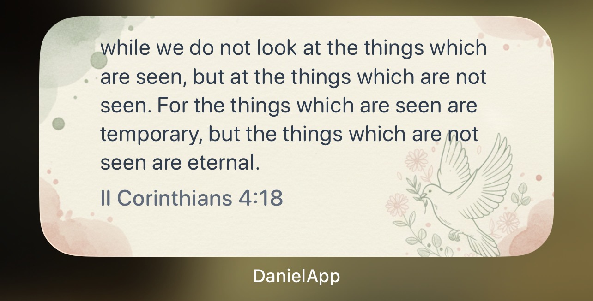
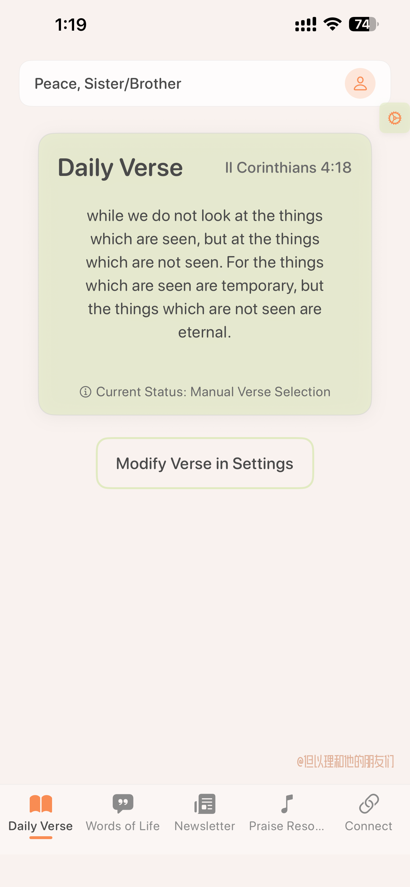
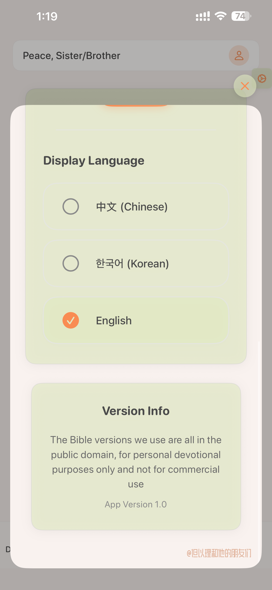
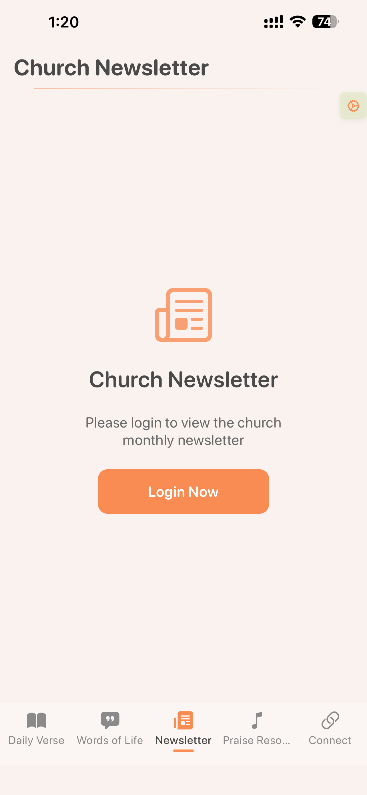
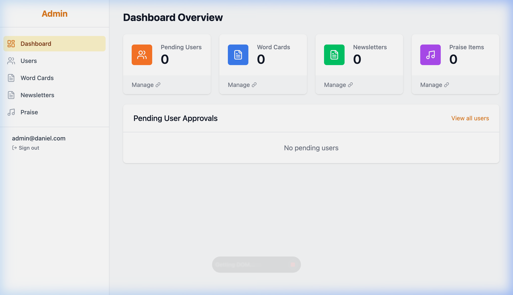
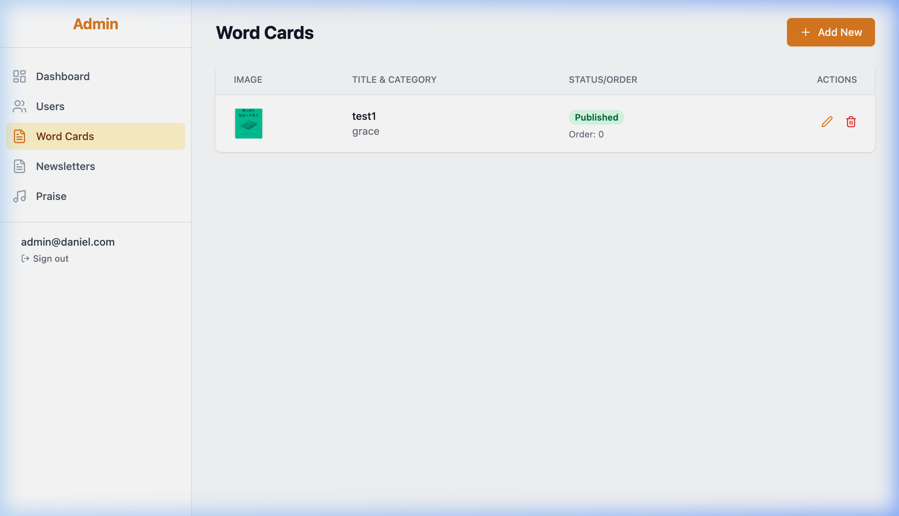
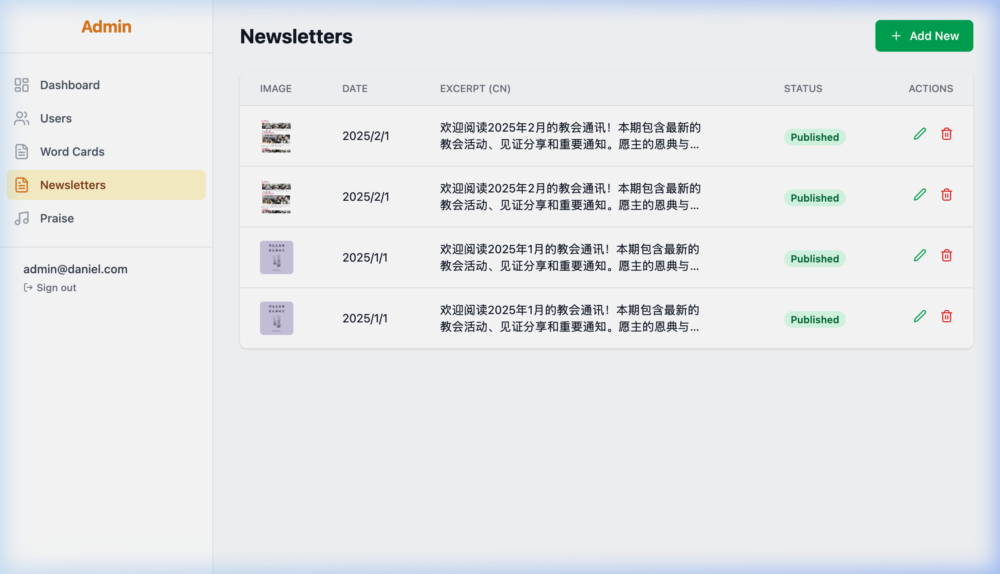

# Daniel & Friends

**A daily Bible verse widget for iOS — built with faith, curiosity, and a whole lot of learning.**

[](https://apps.apple.com/ca/app/danielapp/id6744263240)

`DanielApp` is now available on the App Store:
[https://apps.apple.com/ca/app/danielapp/id6744263240](https://apps.apple.com/ca/app/danielapp/id6744263240)

<p align="center">
  
  &nbsp;&nbsp;
  
  &nbsp;&nbsp;
  
</p>

---

## The Story

It started with Duolingo.

I'd been keeping a daily streak for a while, and one morning it hit me — that little widget on my home screen was genuinely shaping my habits. What if I could have something similar, but instead of a language lesson, it greeted me with a meaningful Bible verse every day?

**Daniel & Friends** is a young-adult community platform built by the Chinese-speaking community within our Korean church. We already have sisters creating beautiful Chinese e-postcards, sharing content on [Instagram](https://www.instagram.com/) and [YouTube](https://www.youtube.com/) — a growing grassroots effort to spread encouragement across cultures. What was missing was a single place to bring it all together: a *Daily Bread*-style app that delivers a fresh verse every morning and serves as a hub for everything our community creates.

The name comes from the Book of Daniel — Daniel and his friends stayed faithful in a foreign land, and that resonated deeply with us as a community navigating life between cultures and languages. Our church is a beautiful mix of Chinese, English, and Korean speakers, so from day one, the app was designed to serve all three languages with a single tap to switch.

**Here's the thing: I only had a basic understanding of iOS development when I started — no hands-on experience.** No real Swift, no Xcode projects, no WidgetKit. I learned by doing — asking questions, iterating, breaking things, and fixing them. Our sisters hand-drew the UI concepts, and I figured out how to bring them to life. This project is proof that curiosity paired with the right tools can take you surprisingly far.

---

## Current Product Direction

The app is being reshaped from a devotional/widget app for "Daniel and his Friends" into a branch-church app. The first product shell is:

`Daily Verse → Connect → Resources → Settings`

- **Daily Verse** keeps the devotional heart: daily scripture, read/favorite/share, widgets, and language settings.
- **Connect** is the church communication hub for branch-scoped announcements, newsletters, and each church's protected KakaoTalk link. Native chat is intentionally outside pilot v1.
- **Resources** is a public church library for Hymnbook, Bible Seminar, Bible Study, Q&A, and useful links, plus native Bible Reader and Favorites tools. A Hymn item may play audio while its PDF remains open below.
- **Settings** is a full page for language, verse update mode, notifications, account, support, and app information.

Agents should read `AGENTS.md` before making changes. Graphify is installed for Codex and project-scoped in this repository; use `graphify query`, `graphify path`, or `graphify explain` before broad code exploration when `graphify-out/graph.json` exists.

---

## Features

- **Daily Verse Widget** — A home screen widget (`systemMedium`) that shows a fresh, meaningful Bible verse every day
- **Lock Screen Widget** — Rectangular and circular lock screen widgets so scripture is always just a glance away
- **Trilingual Support** — Full Chinese / English / Korean support with instant language switching
- **Midnight Auto-Refresh** — A custom update system that ensures the verse changes right at midnight (this was the hardest part — more on that below)
- **Curated Verse Collection** — 642 hand-picked meaningful verses, not random noise
- **Connect Hub** — Church announcements and weekly newsletters powered by the existing Firebase `newsletters` collection
- **Resources Library** — Firebase-backed Hymnbook, seminars, Bible study, Q&A, links, native Bible Reader, and Favorites, with safe local fallback
- **Legacy Content Areas** — Word Cards and Praise remain in the codebase for future reuse/migration, but are not first-level tabs in this phase

<p align="center">
  
  &nbsp;
  
</p>

Some older screenshots still show legacy Word Cards and social-link Connect surfaces. Those files remain useful as historical references, but the current app shell is the four-tab structure described above.

---

## Architecture

### How the Daily Verse Engine Works

The verse system is built on two data layers:

```
verses_index.json     →  642 curated verse references (e.g. "Psalm 23:1", "Romans 8:28")
verses_merged.json    →  18,000+ verses with trilingual content {reference, cn, en, kr}
```

Every day, the app computes which verse to show using a deterministic algorithm:

```swift
let dayOfYear = Calendar.current.ordinality(of: .day, in: .year, for: date) ?? 1
let index = (dayOfYear - 1) % verseIndices.count
```

This means the same day always yields the same verse — no server needed, fully offline-capable. The widget has its own independent dataset (`widget_verses.json`, ~3,800 verses) with a date-seed algorithm, so it can operate even when the main app hasn't been opened.

### The Midnight Update Challenge

> This was genuinely the hardest technical problem I solved. Apple's WidgetKit documentation does **not** clearly explain how to guarantee a widget refreshes at exactly midnight.

Here's what I discovered through extensive experimentation:

**The problem:** WidgetKit's `TimelineProvider` lets you schedule future entries, but iOS throttles widget updates aggressively. Setting `.after(midnight)` as your reload policy does **not** guarantee your widget refreshes at midnight — the system may delay it by minutes or even hours.

**My solution — a multi-layered update strategy:**

```
┌─────────────────────────────────────────────────┐
│           Midnight Update Architecture          │
├─────────────────────────────────────────────────┤
│                                                 │
│  Layer 1: Timeline Policy                       │
│  └─ .after(nextUpdateDate) set to midnight      │
│     or next background-change time              │
│                                                 │
│  Layer 2: Pre-fetch at 23:50                    │
│  └─ MidnightUpdateManager pre-loads tomorrow's  │
│     verse 10 min early, writes to App Group     │
│     shared UserDefaults, then triggers           │
│     WidgetCenter.shared.reloadAllTimelines()    │
│                                                 │
│  Layer 3: Midnight Timer (0:00)                 │
│  └─ Applies the pre-loaded verse, clears stale  │
│     state, sends local notification, triggers   │
│     another widget reload                       │
│                                                 │
│  Layer 4: Foreground Recovery                   │
│  └─ On app foreground, checks if midnight was   │
│     missed (e.g. app was killed), runs          │
│     checkMissedUpdates() to catch up            │
│                                                 │
│  Layer 5: Widget Self-Healing                   │
│  └─ WidgetLifecycleManager detects stale data   │
│     (>25h since last update, or date mismatch)  │
│     and triggers immediate refresh              │
│                                                 │
└─────────────────────────────────────────────────┘
```

The key insight: **you can't rely on any single mechanism.** The pre-fetch at 23:50, the midnight timer, the foreground recovery check, and the widget's own staleness detection all work together as a safety net. When one layer fails (and they will — iOS is aggressive about killing background tasks), another catches it.

### Trilingual Bible Verse System

Supporting three languages sounds simple until you realize:

1. **Different Bible editions have different verse counts.** Some Korean translations include verses that Chinese translations skip, and vice versa. I built a cross-reference validation system in `VerseModels.swift` that normalizes references across all three languages.

2. **Book names need bidirectional mapping.** "创世记" ↔ "Genesis" ↔ "창세기". The app maintains a complete Old/New Testament book name mapping table that handles Roman numerals, abbreviations, and full names in all three languages.

3. **Font rendering matters.** Chinese, English, and Korean each need their own font family for proper rendering. The app uses:
   - Chinese: 爱点风雅黑长体 (a clean, commercial-free Chinese font)
   - English: System rounded font
   - Korean: GowunDodum (a warm, readable Korean font)

### Firebase Integration & Admin Dashboard

The church community features are powered by **Firebase + a custom web Admin Dashboard**, making it easy for our media team to manage content without touching code.

- **Firebase Auth** — Email/password authentication with an approval workflow (new users are `pending` until a church admin approves them)
- **Firestore** — Structured data for Newsletters, Word Cards, Praise files, and approved users with real-time sync
- **Firebase Storage** — Hosts images and PDF files, auto-cleaned when content is deleted from Admin
- **Admin Dashboard** — A React web app for content management (deployed on Vercel, auto-deployed from GitHub)

<p align="center">
  
</p>

<p align="center">
  
  &nbsp;
  
</p>

```
Firestore Collections                Firebase Storage
├── wordCards/                       ├── wordCards/
│   └── {cardId}                     │   └── images...
│       ├── title                    ├── newsletters/
│       ├── category                 │   └── images...
│       ├── caption_cn/en/kr         ├── praises/
│       ├── image_urls[]             │   └── pdfs & images...
│       ├── published                └── v1-v6/  (legacy)
│       └── order                        └── old card data
├── newsletters/
│   └── {newsletterId}
│       ├── publishDate (Timestamp)
│       ├── caption_cn/en/kr
│       ├── image_urls[]
│       └── published
├── praises/
│   └── {praiseId}
│       ├── title
│       ├── fileUrls[]  (images or PDFs)
│       └── uploadedAt (Timestamp)
└── users/
    └── {userId}
        ├── name, gender, email, phone
        ├── churchName, churchCountry
        ├── confirmationPerson
        ├── isApproved
        └── role
```

Current first-phase app usage:
- `newsletters` is used by Connect for announcements and weekly newsletters.
- `users` is used by `AuthManager` for account and access state.
- `wordCards` and `praises` remain available legacy/reusable collections, but the new Resources tab uses local seed data until a Firebase-backed resource library is designed.

### Login, Approval, And Branch-Church Schema

The login system is Firebase Auth plus a Firestore profile at `users/{uid}`. New users can create their own pending profile, but app content access still depends on admin approval through `isApproved`.

Branch-church support is normalized in Firebase while keeping the legacy `churchCountry/churchName` fields for compatibility:

```
organizations/{orgId}
regions/{regionId}
branches/{branchId}
branchMemberships/{branchId}_{uid}
users/{uid}
```

Recommended user profile fields for branch access:

- `orgId`
- `regionId`, `regionName`
- `branchId`, `branchName`
- `role` for legacy compatibility (`admin` or scoped role)
- `accessRole` for scoped authorization (`global_admin`, `region_admin`, `branch_admin`, `member`)
- `membershipStatus` (`pending`, `active`, `requested`, `revoked`)
- `isApproved`, `approvedAt`, `approvedBy`

Firestore rules recognize legacy `role: "admin"` and new `accessRole: "global_admin"` as global admins. Region and branch admins can read scoped users/memberships. Delegated write actions are intentionally handled through the callable Cloud Function `setUserAccessAdmin` instead of direct client Firestore writes.

The admin dashboard includes:

- `Users` for approval, branch assignment, and scoped access role assignment.
- `Branches` for Firebase-backed region and local branch CRUD, including trilingual names, active state, sort order, country/city/timezone, and branch-region mapping.

Admin access modes:

- `global_admin` can manage all users, regions, branches, content pages, and branch assignment.
- `region_admin` can manage users in their own region and assign `member` or `branch_admin`.
- `branch_admin` can approve/revoke member users in their own branch.

`Users` requires the callable Cloud Function `setUserAccessAdmin` so approval, role changes, branch assignment, `branchMemberships`, and Firebase Auth custom claims stay in sync. The callable rejects self-demotion, cross-scope moves, higher-admin management, and global/region-role escalation by scoped admins. There is no direct Firestore fallback because that could leave the profile and Auth claims inconsistent.

The iOS registration page uses `RegistrationBranchViewModel` and an injectable `RegistrationBranchRemoteStore` to read active Firebase `branches` with `isActive == true`, ordered by `sortOrder`, then lets new members choose their branch. The selected branch writes both normalized fields (`orgId`, `regionId`, `branchId`) and legacy compatibility fields (`churchCountry`, `churchName`). If branches cannot be loaded, registration falls back to manual church country/name entry.

Settings shows the signed-in member's branch, region, scoped access role, and review status from the Firebase user profile. These values are read-only in the app; administrators maintain them through Firebase/admin tooling.

Production branch initialization is handled by:

```bash
node scripts/firebase-bootstrap-global-admin.js --project daniel1-ca1e7 --check
node scripts/firebase-bootstrap-global-admin.js --project daniel1-ca1e7 --email admin@daniel.com
node scripts/firebase-bootstrap-global-admin.js --project daniel1-ca1e7 --email admin@daniel.com --confirm-global-admin
node scripts/firebase-seed-branch-system.js --project daniel1-ca1e7
node scripts/firebase-seed-branch-system.js --project daniel1-ca1e7 --confirm-branch-system
```

The older `firebase-seed-branch-system.js` is a legacy migration tool: it derives branches from every existing user and patches those users. Do not use it for the four-church Canada pilot.

The Canada pilot instead has a closed, reviewable manifest at `config/canada-pilot.manifest.json`. It records exactly these four branches and no others:

- 多伦多教会 / Toronto Church / 토론토 교회
- 温哥华教会 / Vancouver Church / 밴쿠버 교회
- 卡尔加里教会 / Calgary Church / 캘거리 교회
- 蒙特利尔教会 / Montreal Church / 몬트리올 교회

Unknown operational data is deliberately `null`; city, IANA timezone, branch-admin email, and KakaoTalk URL must come from the churches. Review the tracked template with an offline dry run:

```bash
node scripts/firebase-init-canada-pilot.js
node scripts/firebase-test-canada-pilot-manifest.js
```

When the verified values arrive, copy the template to the ignored local manifest and fill every placeholder:

```bash
cp config/canada-pilot.manifest.json config/canada-pilot.local.json
```

Set `template` to `false`, review the dry run, and only then use the explicit production confirmation:

```bash
node scripts/firebase-init-canada-pilot.js \
  --manifest config/canada-pilot.local.json \
  --project daniel1-ca1e7

node scripts/firebase-init-canada-pilot.js \
  --manifest config/canada-pilot.local.json \
  --project daniel1-ca1e7 \
  --confirm-canada-pilot
```

The pilot initializer is create-only. It verifies that the existing organization is present, refuses an incomplete/template manifest, refuses emulator variables during confirmation, and refuses to overwrite any matching region, branch, or `branchConnect` document. It never scans or writes `users`, `branchMemberships`, Auth claims, or invite collections.

After document creation, use Admin Portal `Members` to assign each verified email as `branch_admin` through `setUserAccessAdmin`. Then sign in as the scoped administrator and use `Invite & KakaoTalk` to call `createBranchInvite`; the plaintext token is displayed once and is never stored. These steps stay separate because the initializer must not bypass the deployed callable authorization boundary.

Run the `--check` command first to see whether a legacy `role: "admin"` or new `accessRole: "global_admin"` user already exists. The bootstrap command defaults to dry-run and prints the exact Firestore and Auth custom claim changes for the first global admin. The `--confirm-global-admin` command writes production Firestore and Auth custom claims for that one user.

The branch seed command also defaults to dry-run. The `--confirm-branch-system` command writes production Firestore, upserting organization/region/branch/membership documents and patching existing users with branch fields through Firestore update masks. Both production scripts refuse to run when emulator environment variables are set and use Firebase CLI login state instead of service account files.

Production status for project `daniel1-ca1e7` as of 2026-06-07:

- `admin@daniel.com` is bootstrapped as `global_admin` in Firestore and Firebase Auth custom claims.
- Firestore rules/indexes and Cloud Functions are deployed.
- `setUserAccessAdmin`, `deleteUserAdmin`, and `ping` are callable functions in `us-central1`.
- Branch seed is initialized with 1 organization, 2 regions, 2 branches, 5 branch memberships, and 5 user profiles.

Current Product Design and implementation notes for Connect, hymn media, Bible reader, shared favorites, notes, and date-grouped Favorites live in `firebase-product-design.md`. Hymn resources can contain an independent PDF and audio file: the iOS app opens an immersive full-screen reader and keeps a native audio player visible while the PDF is read below it. Newsletter images open in a trilingual full-screen gallery with paging, pinch/double-tap zoom, zoomed panning, and swipe-down dismissal. The Admin Portal accepts PDF plus MP3/M4A/AAC audio, but real copyrighted media must be supplied by the church before the production Hymn entry becomes playable.

The production deployment status above covers the branch/login/resources baseline already deployed with explicit approval. The newer `favorites`, `notes`, and `readingProgress` Firestore rules have been validated against the emulator and are not deployed to production unless that deployment is explicitly approved.

### Data Flow: App ↔ Widget

The main app and widget extension communicate through **App Group shared UserDefaults**:

```
┌──────────────┐         App Group SharedDefaults         ┌──────────────┐
│   Main App   │ ──── widget_verse_reference ──────────── │    Widget    │
│              │ ──── widget_verse_cn / en / kr ────────── │  Extension   │
│  VerseData   │ ──── widget_verse_timestamp ──────────── │  WidgetData  │
│   Service    │ ──── widget_sync_mode ────────────────── │   Manager    │
│              │ ──── widget_is_fixed ─────────────────── │              │
│              │ ──── selectedLanguage ────────────────── │              │
└──────────────┘                                          └──────────────┘
```

The widget can operate in two modes:
- **Synced mode** — Uses verse data written by the main app
- **Independent mode** — Falls back to its own `widget_verses.json` dataset when the main app hasn't been opened recently

---

## Tech Stack

| Layer | Technology |
|-------|-----------|
| iOS App | SwiftUI + WidgetKit |
| Backend | Firebase Auth + Firestore + Storage |
| Admin Dashboard | React + Vite + Tailwind CSS |
| Hosting | Vercel (Admin, GitHub auto-deploy) + Firebase (Backend) |
| Data Persistence | App Group UserDefaults + JSON bundles |
| Architecture | Singleton services + ObservableObject ViewModels |
| Fonts | Custom trilingual font loading |
| Design | Hand-drawn UI concepts by our church sisters |

---

## Project Structure

```
DanielApp/                            # iOS App
├── DanielAppApp.swift               # App entry, Firebase init
├── MainTabView.swift                # 4-tab navigation
├── VerseOfTheDayView.swift          # Daily verse display
├── ChurchCommunicationView.swift    # Connect hub (newsletters + future messages)
├── ChurchResourcesView.swift        # Firebase-backed resource library + local fallback
├── WordCardGalleryView.swift        # Legacy word card gallery (Firestore)
├── NewsletterView.swift             # Reusable church newsletter views (Firestore)
├── PraiseView.swift                 # Legacy praise bookshelf + PDF viewer
├── AuthManager.swift                # Firebase auth + approval workflow
├── MidnightUpdateManager.swift      # Multi-layer midnight refresh
├── SharedModels/                    # Trilingual verse models
├── verses_index.json                # 642 curated verse references
└── verses_merged.json               # 18K+ trilingual verses

admin-web/                            # Admin Dashboard (React)
├── src/
│   ├── pages/
│   │   ├── Dashboard.tsx            # Overview + pending approvals
│   │   ├── WordCardsList.tsx        # CRUD for word cards
│   │   ├── NewslettersList.tsx      # CRUD for newsletters
│   │   ├── PraiseList.tsx           # Upload praise files (PDF/images)
│   │   ├── UsersList.tsx            # User approval and scoped branch access
│   │   └── BranchesList.tsx         # Region and branch management
│   └── lib/firebase.ts             # Firebase client config
├── firestore.rules                  # Security rules
├── storage.rules                    # Storage access rules
└── firestore.indexes.json           # Composite query indexes

daniel wedget/                        # Widget Extension
├── WidgetConfiguration.swift        # TimelineProvider
├── MainVerseWidget.swift            # Home screen widget
└── LockScreenVerseWidget.swift      # Lock screen widget
```

---

## What I Learned

This project taught me more than just iOS development:

- **WidgetKit is powerful but opaque.** The documentation doesn't tell you about update throttling, and you'll only discover the edge cases by shipping to a real device and checking at 12:01 AM whether your verse actually changed.
- **Vibe coding is real.** I went from zero Swift knowledge to a fully functional, multi-target Xcode project by having conversations with AI. The key is asking good questions and understanding *why* the code works, not just copying it.
- **Trilingual apps are harder than 3x the work.** Font rendering, text length differences, and Bible version discrepancies made this way more complex than I expected.
- **App Group shared data is fragile.** UserDefaults synchronization between an app and its widget extension has subtle timing issues that took weeks to debug.

---

## Setup

1. Clone the repository
2. Open `DanielApp.xcodeproj` in Xcode
3. Add your own `GoogleService-Info.plist` from [Firebase Console](https://console.firebase.google.com/)
4. Update the App Group identifier if needed (`group.com.daniel.DanielApp`)
5. Build and run on a real device (widgets don't work well in Simulator)

### Firebase Setup

- `GoogleService-Info.plist` is intentionally ignored because it contains project-specific Firebase identifiers. Use `GoogleService-Info.example.plist` as the shape reference, then place the real plist at the repository root and ensure its iOS bundle id matches `com.daniel.DanielApp`.
- The app calls `FirebaseApp.configure()` in `DanielApp/DanielAppApp.swift`.
- The Xcode project links Firebase Auth, Firestore, Storage, and Analytics through Swift Package Manager.
- Do not commit real Firebase secrets or seed scripts pointed at production.

### Google Sign-In Setup

1. Enable Google under Firebase Authentication > Sign-in method.
2. Download the refreshed iOS `GoogleService-Info.plist`; it must include both `CLIENT_ID` and `REVERSED_CLIENT_ID` and stay ignored by Git.
3. Keep the Google callback URL scheme in `DanielApp/Info.plist` synchronized with that plist's `REVERSED_CLIENT_ID`. The separate `danielapp` scheme must remain for widget and verse deep links.
4. Resolve Swift packages and build. The app uses the official `GoogleSignIn` package, exchanges the Google ID/access tokens for a Firebase credential, and routes first-time provider users into the same minimal profile and church-token onboarding as Apple users.

The OAuth client ID and reversed URL scheme are public application identifiers, not client secrets. Never add an OAuth client secret, service-account key, or private key to the iOS app or repository.

### Firebase Emulator And Tests

Run Firebase work against the local emulator by default:

```bash
scripts/firebase-emulator-start.sh
```

In another terminal, seed repeatable test data:

```bash
FIRESTORE_EMULATOR_HOST=127.0.0.1:8080 \
FIREBASE_AUTH_EMULATOR_HOST=127.0.0.1:9099 \
scripts/firebase-seed-test-data.js
```

Then run Swift tests:

```bash
scripts/run-ios-tests.sh
```

To validate the callable admin boundary against the local emulators:

```bash
firebase emulators:exec --only firestore,auth,functions \
  "FIRESTORE_EMULATOR_HOST=127.0.0.1:8080 FIREBASE_AUTH_EMULATOR_HOST=127.0.0.1:9099 FUNCTIONS_EMULATOR_HOST=127.0.0.1:5001 GCLOUD_PROJECT=daniel1-ca1e7 node scripts/firebase-seed-test-data.js && FIRESTORE_EMULATOR_HOST=127.0.0.1:8080 FIREBASE_AUTH_EMULATOR_HOST=127.0.0.1:9099 FUNCTIONS_EMULATOR_HOST=127.0.0.1:5001 GCLOUD_PROJECT=daniel1-ca1e7 node scripts/firebase-test-callable-admin.js" \
  --project daniel1-ca1e7
```

To validate the Canada pilot invite-token and branch-isolation boundary without touching production:

```bash
firebase emulators:exec --only firestore,auth,functions \
  "FIRESTORE_EMULATOR_HOST=127.0.0.1:8080 FIREBASE_AUTH_EMULATOR_HOST=127.0.0.1:9099 FUNCTIONS_EMULATOR_HOST=127.0.0.1:5001 GCLOUD_PROJECT=demo-daniel-canada node scripts/firebase-seed-test-data.js && FIRESTORE_EMULATOR_HOST=127.0.0.1:8080 FIREBASE_AUTH_EMULATOR_HOST=127.0.0.1:9099 FUNCTIONS_EMULATOR_HOST=127.0.0.1:5001 GCLOUD_PROJECT=demo-daniel-canada node scripts/firebase-test-callable-admin.js && FIRESTORE_EMULATOR_HOST=127.0.0.1:8080 FIREBASE_AUTH_EMULATOR_HOST=127.0.0.1:9099 FUNCTIONS_EMULATOR_HOST=127.0.0.1:5001 GCLOUD_PROJECT=demo-daniel-canada node scripts/firebase-test-branch-invites.js" \
  --project demo-daniel-canada
```

To validate that the tracked four-church manifest cannot expand its scope or write users, memberships, or invite secrets:

```bash
node scripts/firebase-test-canada-pilot-manifest.js
node scripts/firebase-init-canada-pilot.js
```

To validate Storage Rules for public published PDFs and global-admin-only resource uploads:

```bash
firebase emulators:exec --only firestore,auth,storage \
  "FIRESTORE_EMULATOR_HOST=127.0.0.1:8080 FIREBASE_AUTH_EMULATOR_HOST=127.0.0.1:9099 FIREBASE_STORAGE_EMULATOR_HOST=127.0.0.1:9199 GCLOUD_PROJECT=demo-daniel-canada node scripts/firebase-seed-test-data.js && FIRESTORE_EMULATOR_HOST=127.0.0.1:8080 FIREBASE_AUTH_EMULATOR_HOST=127.0.0.1:9099 FIREBASE_STORAGE_EMULATOR_HOST=127.0.0.1:9199 GCLOUD_PROJECT=demo-daniel-canada node scripts/firebase-test-storage-rules.js" \
  --project demo-daniel-canada
```

To initialize the production `resources` collection after rules/indexes are deployed, first inspect the planned payload:

```bash
scripts/firebase-seed-production-resources.js --project daniel1-ca1e7
```

Only after intentionally approving a production write, run:

```bash
scripts/firebase-seed-production-resources.js --project daniel1-ca1e7 --confirm-production-resources
```

The production resources script uses the Firebase CLI login state, refuses emulator env vars, and only upserts the first-phase church resource directory documents.

The test suite covers:
- Daily Verse engagement local-first read/favorite/like state and Firebase merge behavior.
- Unified favorites local-first behavior, signed-in remote push, and login-required notes.
- Firebase emulator round trips for `users/{uid}/verseEngagement/{reference}`.
- Firebase emulator rules for `users/{uid}/favorites`, `users/{uid}/notes`, and `users/{uid}/readingProgress`.
- Connect newsletter loading states and emulator reads from `newsletters`.
- Resources Firebase reads, local seed fallback, search, category filtering, and detail data.
- Firestore rules for owner-only engagement writes, published resource reads, and protected newsletter reads.
- Login and branch profile display mappings for scoped roles, branch/region fallback fields, and review status labels.
- Branch registration reads from active Firebase `branches`.
- Scoped admin callable behavior for global, region, and branch admins against the Functions emulator.

Current Firestore collections used by this phase:
- `users/{uid}/verseEngagement/{reference}` with `reference`, `isRead`, `isFavorite`, `isLiked`, `createdAt`, `updatedAt`.
- `users/{uid}/favorites/{favoriteId}` with `targetType`, `targetId`, localized `title/snippet`, optional `reference`, `resourceId`, `url`, `dateKey`, `createdAt`, and `updatedAt`.
- `users/{uid}/notes/{noteId}` with `targetType`, `targetId`, optional `reference`, `resourceId`, `pageNumber`, `body`, `language`, `isPrivate`, `createdAt`, and `updatedAt`. Notes require login.
- `users/{uid}/readingProgress/{targetId}` for personal Bible/resource progress metadata. Reads and writes are owner-only.
- `newsletters/{newsletterId}` aligned to the existing `Newsletter` model: required `branchId`, `contentType` (`announcement` or `newsletter`), `publishDate`, `image_urls`, `caption_cn`, `caption_en`, `caption_kr`, `published`, plus timestamps.
- `branchConnect/{branchId}` with `branchId`, `groupNameZh`, `groupNameEn`, `groupNameKo`, protected `kakaoURL`, `isActive`, and timestamps. Only active same-branch members and scoped admins can read it.
- `branchInvites/{inviteId}` is server-only and stores `tokenHash`, branch scope, status, expiry, maximum uses, use count, creator, and timestamps. Plaintext tokens are never stored.
- `inviteRedemptions/{inviteId}_{uid}` is a server-only redemption audit. Both invite collections deny all client reads and writes.
- `resources/{resourceId}` with localized `title/subtitle/description/actionTitle`, `type`, `category`, `url`, `content`, `icon`, `isPublished`, `sortOrder`, and timestamps.

---

## Roadmap

- [x] Firebase Firestore migration (from Storage folder structure)
- [x] Admin Dashboard for content management
- [x] PDF viewer for praise sheet music
- [ ] Push notifications for daily verse reminders
- [ ] Verse sharing with beautiful card generation
- [ ] Reading plan / devotional tracker
- [ ] Apple Watch complication

---

## Acknowledgments

- **UI Design** — Hand-drawn by talented sisters in our church, brought to life through AI-assisted implementation
- **Verse Curation** — 642 verses carefully selected for daily encouragement
- **Korean Font** — [GowunDodum](https://fonts.google.com/specimen/Gowun+Dodum) by Yanghee Ryu

---

> *"Unless the Lord builds the house, the builders labor in vain."*
> — Psalm 127:1
